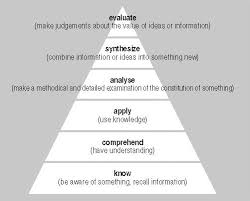
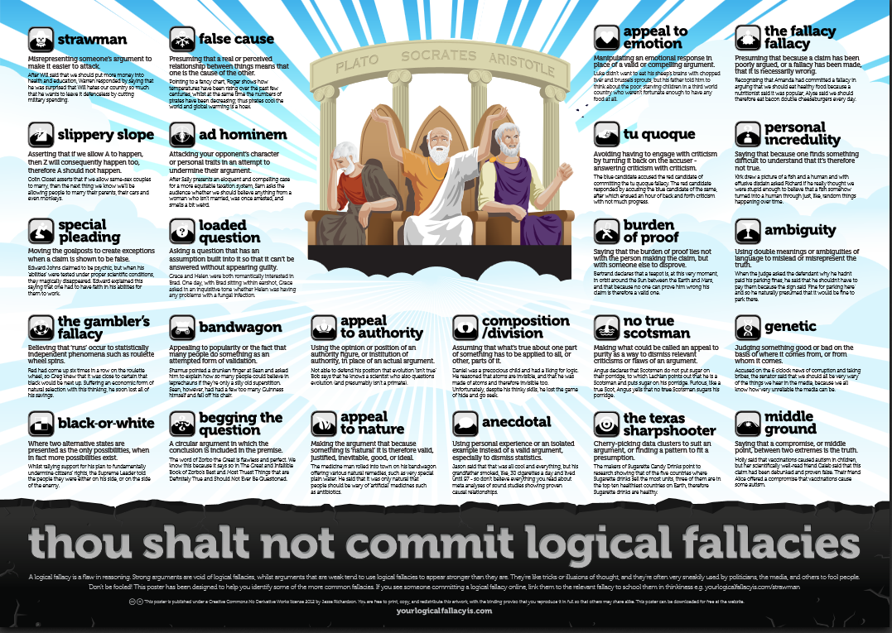

# Critical Thinking

## Why is Critical Thinking Important?

  * It helps you provide strong arguments with the evidence that you hace evaluated.
  * We want to find the truth rather than being right.

## Benjamin Bloom's Thinking Triangle Shows us How to Apply Critical Thinking Skills

 

## Three Steps in Critical Thinking

 ### Identify:

    * We need to identify the main points of the argument.
    * Identify the claims that are made
    * See what evidence is being used
    * What are the conclusions reached

 ### Analyse:

    * Does the information make sense in relation to other research?
    * How old is the material?
    * Does the argument present a balanced view

 ### Apply:
  
    * What are the implications of other information?
    * What are the weaknesses when applied to a real life situation?
    * Is there a lack of coverage?

 ## Three Modes of Thinking

  ### Divergent
     
     * Imagination - question -> idea etc. (think about the film series 'Divergent' and what it is about

  ### Convergent

     * Logic - fact -> answer etc.

  ### Lateral

     * Combination of both

## Incorrect Attitudes

  * Arguing for the sake of it.
  * Wanting to prove the other person wrong so much that you disregard they point completely.

## Enquiry Based Learning

  * It's the concept of learning by asking questions and not jumping to conclusions.

### What Type of Questions might we ask?

  Make sure your first few questions help ease into the conversation.

  * What is the source of evidence?
  * What claims are being made?
  * What are the strengths and weaknesses of the evidence?
  * Is the argument a balanced one?
  * Do we understand the context?

DO NOT ASSUME!!

## Basica Argument Structure

 * Claim - Clearly present your argument
 * Evidence - Make sure you back up your claim with evidence
 * Impact - What is the significance of this evidence?

## Logical Fallacies

 * False dichotomy - When the speaker forces a debate into two sides (devils advocate)
 * Straw man
 * Contradiction

## The Pillars of Persuasion

  * Ethos - Appealing through authority or credibility
  * Pathos - Appealing through emotional empathy
  * Logos - Appealing through logic and reasoning.

## Debating Skills and Etiquette

### Do:

  * Prepare
  * Be calm
  * Speak clearly and assert yourself
  * Be articulate
  * LISTEN!

### Don't:
  
  * Declare false evidence.
  * Attack a speaker
  * Be Aggresive
  * Interrupt
  * Disagree with clear facts
  * Raise your voice to make your argument stronger becuase it doesn't

REMEMBER: It is okay to be wrong or to have a different view to others.

