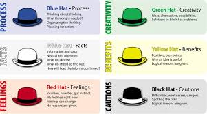

# Notes on communication from day two

##Ith's Principles:
 
 * Everything we do is a form of communication.
 * The way we begin our message often determines the outcome.
 * Deliver always affects the message.

## The Effect of Poor Communication on Business:

 * Loss of potential business
 * Mistakes
 * Lack of coordination as well as organisation.
 * Damage to the image of the business.

## Barriers to Good Communication:

 * Language barriers
 * Groups not being on the same page
 * More than one person wanting to lead
 * Personal
 * Physicsl
 * Geographical
 * Cultural
 * Organisation

## Positive Actions Within the Workplace:

 * Don't stereotype.
 * Be open to ideas outside of the box or your existing beliefs.
 * Stay level headed and treat other people with respe

## 6 Thinking Hats (white, yellow, black, red, green, blue)
 
  

## Cognitive Biases
 
 * This refers to the part of the brain that programs itself to think or interperet things in a certain way.
   It may not be the correct way but because the brain is set on this way of thinking, it makes interpereting in 
   other ways a bit more difficult.

 * The brain also makes mistakes.   

## Other Biases

  * Anchoring Biases
  * Confirmation Biases
  * Choice Supportive Bias
  * Outcome Bias
  * Bandwagon Bias

## Reasons for Conflict
  
  * More than one person trying to lead
  * Clashes between personalities
  * Misscommunication
  * Taking constructive criticism in the wrong way
  * Criticising without being constructive

## Ways to Avoid Conflict

  * Take time to fully understand and appreciate the situation.
  * Cater for the correct audience (Know your audience)
  * Be willing to take on board another perspective and be willing to compromise
  * Understand that one person may not receive your point as someone else.
  * Respect everyone's differences.
