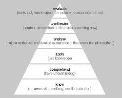

# Critical Thinking

## Why is Critical Thinking Important?

  * It helps you provide strong arguments with the evidence that you hace evaluated.
  * We want to find the truth rather than being right.

## Benjamin Bloom's Thinking Triangle Shows us How to Apply Critical Thinking Skills

### 
