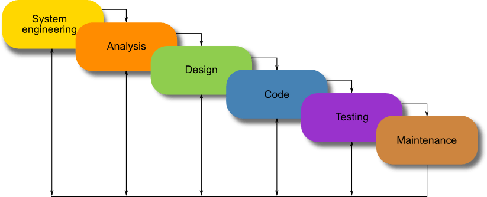

# Project Environment

## Project vs BAU

* Business as usual is basic day-to-day operations and structure that keep the company running (routine). It is ongoing.
	- The general principles of the business that are followed, e.g. Starting at 9am and finishing at 5pm.

* Project follows the same BAU principles.
	- e.g. all ongoing projects or events in the organisation eg. Python DevOps.

## Project Cycle

1. Initiation
2. Planning
3. Executing
4. Monitoring and Controlling
5. Closing

## Project Constraints

* Time 
* Cost
* Quality

**NOTE: projects require a balance of these three contraints depending on the needs of the customer**

## Software Development Lifecycles:

* Waterfall:
	- System Requirements
	- Software Requirements
	- Analysis
	- Design
	- Coding
	- Testing 
	- Maintenance

* V-Model:
	- Business Requirement Specification => Acceptance Testing
	- Functional Requirement Specification => System Testing
	- Software Design => Integration Testing
	- Program Specification => Unit Testing
	- Coding

* Agile:
	- Entry
	- Plan (Design)
	- Do (code)
	- Check (Test)
	- Exit

## Scrum Framework

* Product Backlog
* Sprint Planning
* Sprint Backlog
* Scrum Team
* Daily Scrum
* Sprint Review
* Sprint Retrospective
* Increment

## Teams

### Attributes of Mature Teams

* Co-located
* Cross functional roles
* self - organising
* Accountable and empowered

### Projects are Difficult
	- Create a positive atmosphere
	- Manage conflict intelligently
	- Have open and clear communication
	- Respect all your peers
	- Become trustworthy

### Why do Projects Fail?
	- Problems show up too late (waterfall)
	- Lack of communication with the client
	- Lack of teamwork
	- Timing

## Departments:
	- BA: Business Admin
	- QA: Quality Assurance
	- Dev: Development
	- PM Project Management
	- UX: Front End

